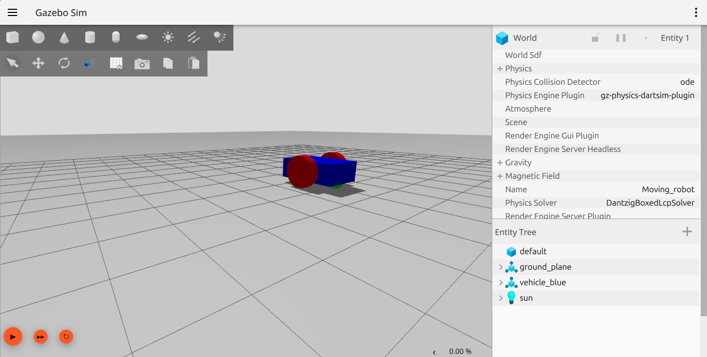
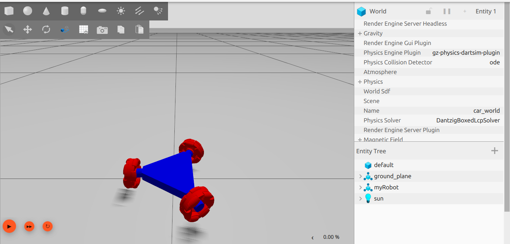

# GAZEBO SIMULATOR BASIC ROBOT



## Run

Go to the folder containing the file building_robot.sdf
```bash
gz sim building_robot.sdf
```

## controller

in terminal 1:
```bash
ros2 run ros_gz_bridge parameter_bridge /cmd_vel@geometry_msgs/msg/Twist@gz.msgs.Twist
```

in terminal 2:
```bash
gz sim building_robot.sdf
```

in terminal 3: 
```bash
sudo apt install ros-jazzy-teleop-twist-keyboard
```
```bash
ros2 run teleop_twist_keyboard teleop_twist_keyboard
```
# GAZEBO SIMULATOR MY ROBOT
